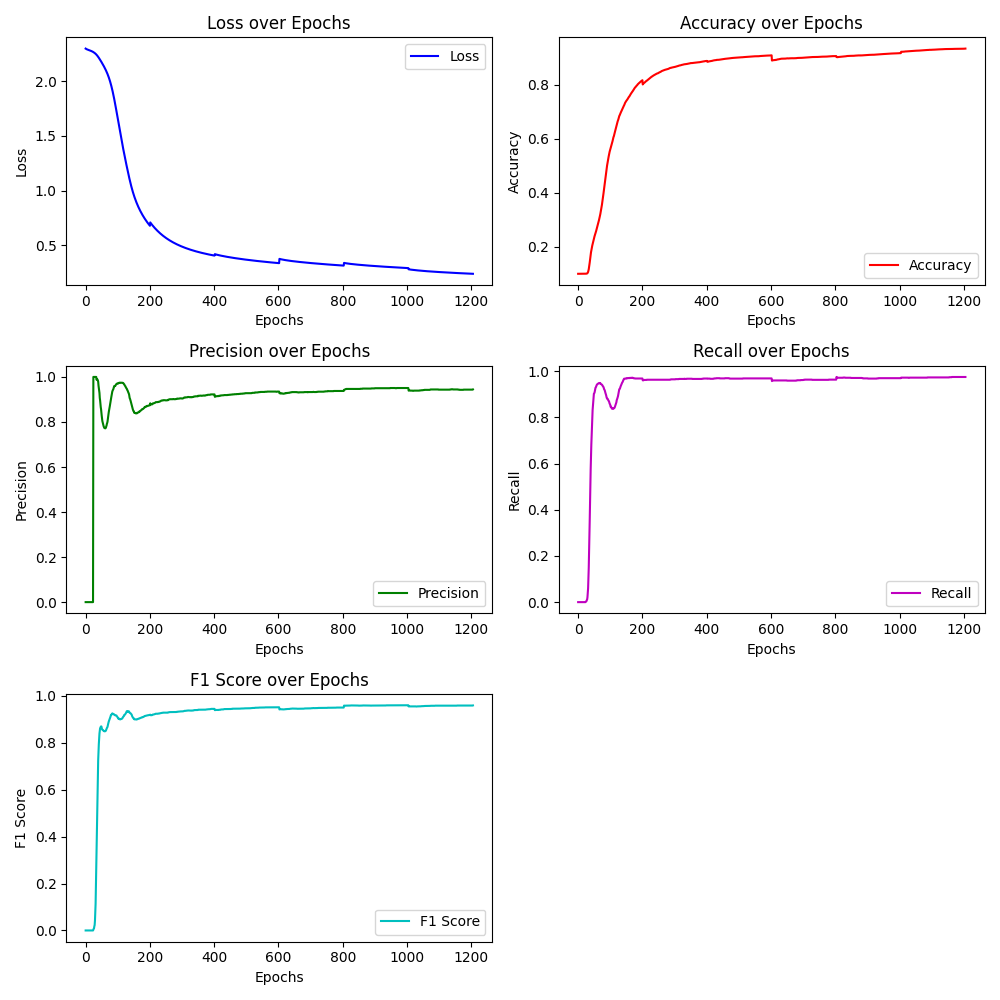

# Neural Network Project

This repository contains a custom implementation of neural networks in Python, including functionalities for training, evaluating, and visualizing performance metrics. To test the efficacy of my implementation, I trained a network on the MNIST dataset, a popular dataset of handwritten digits used for training various image processing systems.

## Table of Contents

1. [Features](#features)
2. [Installation](#installation)
3. [Usage](#usage)
4. [File Descriptions](#file-descriptions)
5. [Training the Network](#training-the-network)
6. [Testing and Evaluation](#testing-and-evaluation)
7. [Example Usage](#example-usage)
8. [License](#license)

## Features

- **Custom Neural Network Implementation**: Build and train a neural network with configurable layers and activation functions.
- **Activation Functions**: Includes ReLU and Softmax activation functions.
- **Loss Functions**: Supports Cross Entropy Loss and Mean Squared Error Loss.
- **Model Saving and Loading**: Save and load trained models using joblib.
- **Performance Metrics**: Track and visualize loss, accuracy, precision, recall, and F1 score over epochs.
- **Easily Expandable**: Adding new Activation functions, Loss functions, and other features can be done with ease. 

## Installation

Ensure you have Python 3.6+ installed. The following Python packages are required:

- `numpy`
- `matplotlib`
- `joblib`

You can install the required packages using pip:

```sh
pip install numpy matplotlib joblib
```

## Usage

1. **Model Definition and Training**

   Define the network structure, add layers, and train the model using the MNIST dataset.

   ```python
   from neural_net import Network, ReLU, Cross_Entropy_Loss, Layer
   import numpy as np
   import struct

   # Load and preprocess MNIST dataset
   trainImages = read_mnist("MNIST_ORG/train-images.idx3-ubyte")
   trainLabels = read_labels("MNIST_ORG/train-labels.idx1-ubyte")
   trainImages = trainImages.reshape(trainImages.shape[0], -1).astype(np.float32) / 255.0

   # Define and train the network
   net = Network(784, Cross_Entropy_Loss)
   net.add_layer(784, 32, ReLU)
   net.add_layer(32, 10, Softmax)
   net.train(trainImages, trainLabels, epochs=1000, report=3)
   net.save_model("MNIST_32x10")
   ```
## Testing and Evaluation

After training the model, you can test and evaluate its performance on the MNIST test dataset.

1. **Load and preprocess the MNIST test dataset:**

   ```python
   from neural_net import Network, Cross_Entropy_Loss

   # Load and preprocess MNIST test data
   testImages = read_mnist("MNIST_ORG/t10k-images.idx3-ubyte")
   testLabels = read_labels("MNIST_ORG/t10k-labels.idx1-ubyte")
   testImages = testImages.reshape(testImages.shape[0], -1).astype(np.float32) / 255.0
   ```
2. **Load the trained model and evaluate it:**   
   ```python
   # Load the trained model
   net = Network(inputNeurons=testImages.shape[1], loss=Cross_Entropy_Loss)
   net = net.load_model("MNIST_32x10")
    
   # Evaluate the model
   stats = net.get_stats(testImages, testLabels)
   print(stats)
   ```

## File Descriptions

- **`neural_net.py`**: Contains the implementation of the neural network, including:
  - `Network`: The main neural network class that manages layers, training, and evaluation.
  - `Layer`: Defines individual layers with weights, biases, and activation functions.
  - **Activation Functions**: Includes `ReLU` and `Softmax`.
  - **Loss Functions**: Implements `Cross_Entropy_Loss` and `Mean_Squared_Error_Loss`.

- **`driver.py`**: Demonstrates how to use the neural network for training and testing:
  - Defines network architecture.
  - Trains the network on MNIST data.
  - Saves the trained model and evaluates its performance.
  
  `Check previous commits to find older versions in which the network is trained.`

## Training the Network

To train the network:

1. Ensure that the input data is correctly formatted.
  - Inputs should be arranged into a array
    - Single input:  `inputs = [[1, 2, 3, 4]]`
    - multiple inputs:   `inputs = [[1, 2, 3], [4, 5, 6], [7, 8, 9]]`
3. Modify the `driver.py` script to configure the network architecture and training parameters according to your needs.
4. Run the script to train the network and save the model.

## Testing and Evaluation

To test the trained network:

1. Load the trained model using the `Network.load_model()` method.
2. Evaluate the model's performance using the `Network.get_stats()` method with test data.
3. Print or visualize the performance metrics to assess accuracy and other evaluation statistics.

## Example Usage

I tested the neural network by training a network to identify characters from the MNIST dataset. To do so, I first created a network of 784 inputs, a single hidden layer of 32 neurons which used a ReLU activation, and an output layer of 10 neurons using a SoftMax activation. Alongside this, I loaded the 60000 training images and labels from the MNIST dataset, which I had downloaded from [yann.lecun.com](https://yann.lecun.com/exdb/mnist/). I wrote functions to read the files and organise the resulting images into a usable format.

```python
  from neural_net import *
  import numpy as np
  import struct
  
  def read_mnist(filePath):
      with open(filePath, 'rb') as f:
          # Read the header
          magic_number = struct.unpack('>I', f.read(4))[0]
          num_images = struct.unpack('>I', f.read(4))[0]
          num_rows = struct.unpack('>I', f.read(4))[0]
          num_cols = struct.unpack('>I', f.read(4))[0]
          
          # Read the image data
          images = np.fromfile(f, dtype=np.uint8).reshape(num_images, num_rows, num_cols)
          
      return images
  
  def read_labels(filePath):
      with open(filePath, 'rb') as f:
          # Read the header
          magic_number = struct.unpack('>I', f.read(4))[0]
          num_labels = struct.unpack('>I', f.read(4))[0]
          
          # Read the label data
          labels = np.fromfile(f, dtype=np.uint8)
          
      return labels
  
  trainImages = read_mnist("MNIST_ORG/train-images.idx3-ubyte")
  trainLabels = read_labels("MNIST_ORG/train-labels.idx1-ubyte")
  trainImages = trainImages.reshape(trainImages.shape[0], -1).astype(np.float32) / 255.0
  # trainLabels = one_hot_encode(trainLabels, 10)
  
  testImages = read_mnist("MNIST_ORG/t10k-images.idx3-ubyte")
  testLabels = read_labels("MNIST_ORG/t10k-labels.idx1-ubyte")
  testImages = testImages.reshape(testImages.shape[0], -1).astype(np.float32) / 255.0
  # testLabels = one_hot_encode(testLabels, 10)
  
  print(trainLabels)
  
  net = Network(784, Cross_Entropy_Loss)
  net.add_layer(784, 32, ReLU)
  net.add_layer(32, 10, Softmax)
```

With the network created, I trained the network in 6 batches of 10000 images, with 200 episodes of training for each batch. After training completed, I saved the model, and plot the metrics.

```python
for i in range(0, 6):
    if i == 0:
        net.train(trainImages[0:10000], trainLabels[0:10000], 200, 1)
    else:
        net.train(trainImages[(i*10000) + 1:(i+1)*10000], trainLabels[(i*10000) + 1:(i+1)*10000], 200, 1)

net.plot_metrics("MNIST Second run, batches, (32, 10), 1000 epoch")

net.save_model("MNIST_32x10")
```


This image shows the resulting metrics from training on all 60000 images. The network successfully predicts MNIST digits from the training set, with a final accuracy around 92%. To test this, I then ran the network on the remaining test images, and printed the stats over all the images.

```python
## Load images and labels for testing
testImages = read_mnist("MNIST_ORG/t10k-images.idx3-ubyte")
testLabels = read_labels("MNIST_ORG/t10k-labels.idx1-ubyte")
testImages = testImages.reshape(testImages.shape[0], -1).astype(np.float32) / 255.0

## Loads and tests the network
net = Network(0, Cross_Entropy_Loss)
net = net.load_model("MNIST_32x10")

stats = net.get_stats(testImages, testLabels)
print(stats)
```
The output was:
`{'loss': 0.273352538845647, 'accuracy': 0.9218, 'precision': 0.965938864628821, 'recall': 0.9744493392070485, 'f1_score': 0.9701754385964912}`

These statistics show that the network was very successful in recognising digits.


## License
---

Feel free to contribute to this project by submitting issues or pull requests. For any questions or further information, please contact the project maintainer.

---

**Notice**: You are free to use, modify, and distribute this code as needed. The author of this project is Lewis Murphy, @defalt0402. If you have any questions or need further clarification, please reach out!


